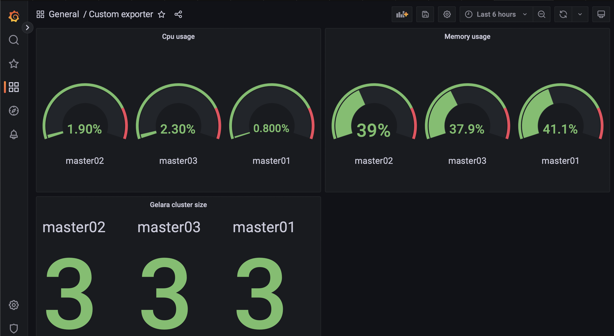

# Configuration

## Setup project

Install requirements and ansible on ubuntu controller:
```bash
sudo apt install python3-venv
git clone git@github.com:legitYosal/gelara-lab.git
cd elara-lab
git submodule update --init --recursive
python3 -m venv env
source env/bin/activate
pip install -r requirements.txt
```
## Infra

Bootstrap cluster:  
```
ansible-playbook -i inventories/hosts.ini facts.yml
ansible-playbook -i inventories/hosts.ini deployment.yml --ask-vault-pass
```

cluster map:
```

                                        access -grafana
                                               -prometheus
                                    │  │
                                    │  │
                                    │  │
                                   ┌▼──▼┐
    ┌──────────────────────────────┤lb01├───────────────────────────┐
    │                              └───┬┘                           │
    │                                  │                            │
    │                                  └───────────┐                │
    │       ┌────────────────┐                     │                │
    │       │                │               ┌─────▼──────┐         │
    │   ┌───▼────┐      ┌────▼───┐           │monitoring01│         │
    │   │master01│      │master02│           └────────────┘         │
    │   └───▲────┘      └────▲───┘                                  │
    │       │                │                                      │
    │       │   ┌────────┐   │                                      │
    │       └───►master03◄───┘                      ┌────────┐      │
    │           └────────┘                   ┌──────┤runner01│      │
    │                                        │      └────────┘      │
    │                        ┌───────────────┘                      │
    │                        │                                      │
    │              ┌─────────┼─┐                                    │
    └──────────────┤gateway01│ ├────────────────────────────────────┘
                   └────▲────┼─┘-internal nodes has internet access with gw
                        │    │  -admin ssh path
                        │    │
                        │    │
                             │
                         ┌───▼──────┐
                         │github.com│
                         └──────────┘

```

# MariaDB
MariaDB Galera Cluster is a virtually synchronous multi-primary cluster for MariaDB. It is available on Linux only, and only supports the InnoDB storage engine.  
MariaDB have two storage backends named InnoDB and MyISAM, These two differ on their locking implementation: InnoDB locks the particular row in the table, and MyISAM locks the entire MySQL table. [source](https://stackoverflow.com/a/5414622/12131234)


## Monitoring
We use python prometheus client to collect metrics on cluster status and cpu, memory usage, in `apps/db-exporter`, using github actions its image will be build and published on private registry in the cluster, a picture of grafana dashboard:


## Bootstrap Gelara cluster
First you must bootstrap one primary node and afterwards you can join other masters in the cluster.  
For you can put in `my.cnf` of each node:
```
     ...
     ...
# Galera Cluster Configuration
wsrep_cluster_name="test_cluster"
wsrep_cluster_address="gcomm://First_Node_IP,Second_Node_IP,Third_Node_IP"
     ...
     ...
```
And initially Startup one node to build the primary node of cluster.

### Bitnami
Using docker we can create a Gelara cluster very simpler by using bitnami image, We use `MARIADB_GALERA_CLUSTER_BOOTSTRAP` environment variable on bootstrap master node to specify primary node.  
